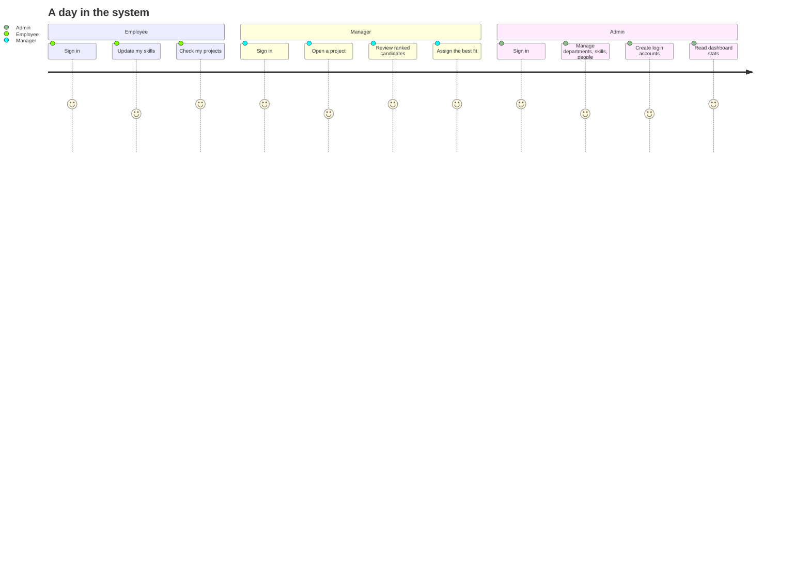
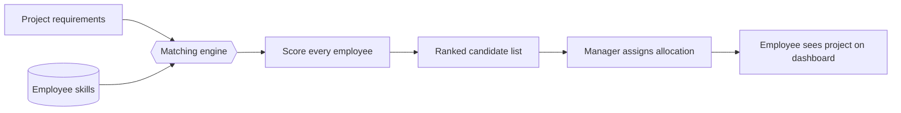
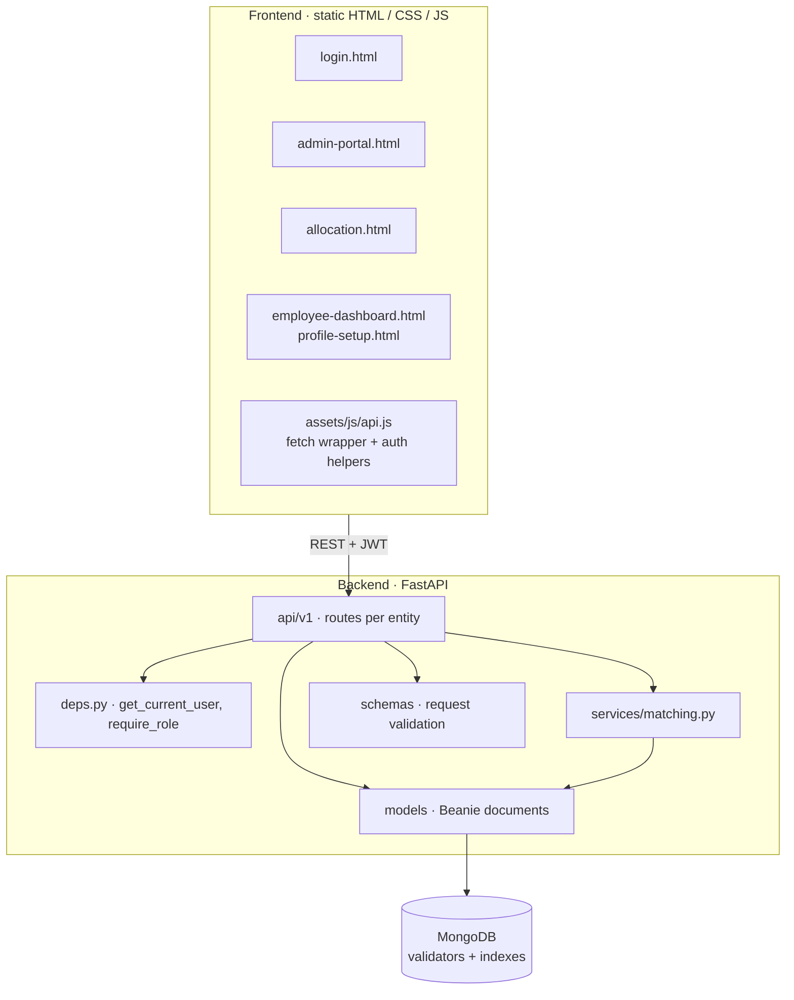

<div align="center">

# 🧩 Employee Skill & Project Allocation System

### Match the right people to the right projects — by skill, not by guesswork.

A full-stack, role-based platform that tracks employee skills, defines project requirements,
and **automatically ranks the best-fit candidates** for every project.


[Features](#-key-features) · [Portal Tour](#️-portal-tour) · [Matching Engine](#-the-matching-engine) · [Architecture](#-architecture) ·
[Quick Start](#-quick-start) · [Roles](#-roles--permissions) · [Skills Demonstrated](#-skills-demonstrated) ·
[Roadmap](#-roadmap)

</div>

---

## 📖 Overview

Staffing projects is usually done from memory, spreadsheets, and gut feeling. This system replaces that with a
single source of truth:

1. **Employees** maintain a profile and the skills they have.
2. **Managers** define projects and the skills those projects need.
3. The **matching engine** scores every employee against a project and returns a **ranked list of candidates**.
4. Managers **allocate** the best fits in one click, and employees see their assignments on their own dashboard.

Everything is protected by **JWT authentication** and **role-based access control**, so each person only sees and
changes what they are allowed to.

> ✅ Built to run with **zero frontend tooling** (no Node, no bundler) and a **single backend command**.

---

## ✨ Key Features

| | Capability | What it gives you |
|---|---|---|
| 🎯 | **Skill-based candidate ranking** | Instantly see who fits a project best, ordered by match score |
| 🔐 | **JWT login + 3 roles** | Admin, Manager and Employee each get their own permissions and portal |
| 🗂️ | **Full CRUD on every entity** | Departments, skills, employees, projects, allocations and user accounts |
| 📊 | **Admin dashboard stats** | A high-level view of the organisation at a glance |
| 👤 | **Employee self-service** | Staff manage their own profile and skills, keeping data fresh without admin effort |
| 🧑‍💼 | **One-click allocation** | Pick a project, review ranked candidates, assign |
| 📘 | **Interactive API docs** | Every endpoint documented and testable through Swagger UI at `/docs` |
| 🛡️ | **Database-level validation** | MongoDB validators and indexes protect data quality even outside the app |
| 🌱 | **Seed data included** | Sample records and ready-made demo accounts, so the app is useful on first run |
| 🧪 | **End-to-end tested** | CRUD flows, login, role permissions and the matching engine verified with a headless browser |

---

## 🖥️ Portal Tour

Each role gets its own portal. The wireframes below are illustrative sketches of what every screen does, so they
render everywhere without needing image files.

### Who does what



<details>
<summary><b>1 · Login</b> &nbsp;·&nbsp; one door, three destinations</summary>

```
┌──────────────────────────────────────────┐
│     Employee Skill & Project Allocation  │
│                                          │
│   Username  [ asha                    ]  │
│   Password  [ ••••••••••              ]  │
│                                          │
│            [       Sign in       ]       │
│                                          │
│   Admin    ──►  Admin Portal             │
│   Manager  ──►  Allocation page          │
│   Employee ──►  My Dashboard             │
└──────────────────────────────────────────┘
```

</details>

<details>
<summary><b>2 · Admin Portal</b> &nbsp;·&nbsp; full control and the big picture</summary>

```
┌─────────────┬────────────────────────────────────────────┐
│ ▸ Dashboard │  Dashboard                                 │
│   Departments│ ┌──────────┐┌──────────┐┌───────────────┐ │
│   Skills    │  │Employees ││ Projects ││ Allocations   │ │
│   Employees │  │   sample ││  sample  ││    sample     │ │
│   Projects  │  └──────────┘└──────────┘└───────────────┘ │
│   Allocations│                                           │
│   User      │  Employees                [ + Add new ]    │
│   Accounts  │  ┌────────────┬────────────┬────────────┐  │
│             │  │ Name       │ Department │ Actions    │  │
│             │  ├────────────┼────────────┼────────────┤  │
│             │  │ ...        │ ...        │ Edit  Del  │  │
│             │  └────────────┴────────────┴────────────┘  │
└─────────────┴────────────────────────────────────────────┘
```

</details>

<details>
<summary><b>3 · Allocation (Manager)</b> &nbsp;·&nbsp; pick a project, get ranked candidates, assign</summary>

```
┌──────────────────────────────────────────────────────────┐
│  Project  [ Select a project                        ▾ ]  │
│                                                          │
│  Required skills:  (Skill A) (Skill B) (Skill C)         │
│                                                          │
│  Ranked candidates                                       │
│  ┌───┬────────────┬─────────────────────┬──────────────┐ │
│  │ # │ Employee   │ Match               │              │ │
│  ├───┼────────────┼─────────────────────┼──────────────┤ │
│  │ 1 │ ...        │ ██████████████░░░░  │  [ Assign ]  │ │
│  │ 2 │ ...        │ ███████████░░░░░░░  │  [ Assign ]  │ │
│  │ 3 │ ...        │ ███████░░░░░░░░░░░  │  [ Assign ]  │ │
│  └───┴────────────┴─────────────────────┴──────────────┘ │
└──────────────────────────────────────────────────────────┘
```

</details>

<details>
<summary><b>4 · Employee Dashboard</b> &nbsp;·&nbsp; my profile, my skills, my projects</summary>

```
┌──────────────────────────────────────────────────────────┐
│  👤 My Profile                                           │
│     Name · Department · Role                             │
│                                                          │
│  My Skills                         [ Manage skills ]     │
│   (Skill A) (Skill B) (Skill C) (Skill D)                │
│                                                          │
│  My Projects                                             │
│   ▸ Project name ........................ assigned       │
│   ▸ Project name ........................ assigned       │
└──────────────────────────────────────────────────────────┘
```

</details>

<details>
<summary><b>5 · Profile Setup</b> &nbsp;·&nbsp; employees keep their own skills current</summary>

```
┌──────────────────────────────────────────────────────────┐
│  Add a skill   [ Choose a skill                     ▾ ]  │
│                                          [ + Add ]       │
│                                                          │
│  Your skills                                             │
│   Skill A   ✕        Skill B   ✕        Skill C   ✕      │
│                                                          │
│                                          [ Save ]        │
└──────────────────────────────────────────────────────────┘
```

</details>

<details>
<summary><b>6 · Interactive API Docs</b> &nbsp;·&nbsp; every endpoint, testable in the browser</summary>

```
┌──────────────────────────────────────────────────────────┐
│  Swagger UI                         http://localhost:8000/docs
│                                                          │
│  ▸ auth / users                                          │
│  ▸ departments                                           │
│  ▸ skills                                                │
│  ▸ employees                                             │
│  ▸ projects                                              │
│  ▸ allocations                                           │
│        GET · POST · PUT · DELETE     [ Try it out ]      │
└──────────────────────────────────────────────────────────┘
```

</details>

> 💡 Want real screenshots later? Put the PNGs in `docs/screenshots/` and swap each wireframe for
> ``.

---

## 🧠 The Matching Engine

The heart of the project lives in `backend/app/services/matching.py`.

For a selected project, the engine:

1. Reads the **skills the project requires**.
2. Compares them against the **skills each employee holds**.
3. Computes a **score per employee**.
4. Returns candidates **ranked from best to weakest fit**, ready for the Manager to assign.



Keeping this logic in its own **service layer** means the scoring rules can be tuned or replaced without touching
any route or UI code.

---

## 🏗️ Architecture



### Design choices worth noting

- **Layered backend** — routes, request schemas, database models and business logic are separated, so each can
  change independently.
- **Async from top to bottom** — FastAPI with Beanie (async ODM) over MongoDB.
- **Auth as dependencies** — `get_current_user` and `require_role` are reusable guards applied per route.
- **Defence in depth** — input is validated by Pydantic schemas *and* by MongoDB schema validators.
- **No build step on the frontend** — plain files served statically; one shared `api.js` handles requests and
  authentication.

---

## 🚀 Quick Start

### Prerequisites

- Python 3.10+
- MongoDB — local (`mongodb://localhost:27017`) **or** a free MongoDB Atlas cluster
- `mongosh` (to run the schema script once)

### 1 · Set up MongoDB

Create the collections, validators and indexes once:

```bash
mongosh "<your-connection-string>" --file backend/mongo_schema.js
```

### 2 · Run the backend

```bash
cd backend
python -m venv venv
source venv/bin/activate        # Windows: venv\Scripts\activate
pip install -r requirements.txt

cp .env.example .env
# edit .env: set MONGO_URI (and MONGO_DB_NAME if you changed it),
# and set JWT_SECRET_KEY to a real random value:
python -c "import secrets; print(secrets.token_hex(32))"
```

Load sample data and demo accounts:

```bash
python -m scripts.seed_data
```

Start the API:

```bash
uvicorn app.main:app --reload
```

📘 Interactive API docs: **http://localhost:8000/docs**

### 3 · Run the frontend

The frontend is static but must be **served over HTTP** (opening the files directly via `file://` makes the browser
block API calls).

```bash
cd frontend
python -m http.server 5500
```

Open **http://localhost:5500/login.html**

> Backend on a different address? Change `API_BASE` at the top of `frontend/assets/js/api.js`.

### 🔑 Demo accounts

| Username | Password      | Role     | Lands on |
|----------|---------------|----------|----------|
| `admin`  | `admin123`    | Admin    | Admin portal |
| `asha`   | `password123` | Manager  | Allocation page |
| `danny`  | `password123` | Employee | Employee dashboard |

> ⚠️ These are demo credentials for local use only. Change or remove them before any real deployment.

---

## 👥 Roles & Permissions

| Capability | 🛡️ Admin | 🧑‍💼 Manager | 👤 Employee |
|---|:---:|:---:|:---:|
| Manage departments | ✅ | – | – |
| Manage employees | ✅ | – | Own profile only |
| Create / edit skills | ✅ | ✅ | – |
| Create / edit projects | ✅ | ✅ | – |
| View ranked candidates for a project | ✅ | ✅ | – |
| Assign allocations | ✅ | ✅ | – |
| Manage login accounts | ✅ | – | – |
| View dashboard statistics | ✅ | – | – |
| Maintain own skills | ✅ | – | ✅ |
| View own projects | ✅ | – | ✅ |

Each role is redirected to its own portal right after login.

---

## 🗺️ Project Structure

```
backend/
├── mongo_schema.js           # run once: collections, validators, indexes
├── requirements.txt
├── .env.example
├── app/
│   ├── main.py               # FastAPI entry point
│   ├── models/               # Beanie documents (mirror mongo_schema.js)
│   ├── schemas/              # Create/Update request bodies
│   ├── api/v1/               # routes, grouped by entity
│   ├── services/matching.py  # skill-matching / scoring logic
│   └── deps.py               # auth dependencies (get_current_user, require_role)
└── scripts/
    └── seed_data.py          # sample data + demo accounts

frontend/
├── login.html                # entry point, redirects by role
├── admin-portal.html         # departments, skills, employees, projects,
│                             # allocations, user accounts, dashboard stats
├── allocation.html           # Manager: pick project → ranked candidates → assign
├── employee-dashboard.html   # Employee: profile, skills, projects
├── profile-setup.html        # Employee: self-service skill management
└── assets/js/api.js          # shared fetch wrapper + auth helpers
```

---

## 🛠️ Tech Stack

| Layer | Technology |
|---|---|
| **API framework** | FastAPI |
| **Database** | MongoDB (local or Atlas) |
| **ODM** | Beanie (async, built on Pydantic) |
| **Auth** | JWT bearer tokens, role-based dependencies |
| **Validation** | Pydantic schemas + MongoDB JSON-schema validators |
| **Frontend** | HTML5, CSS3, vanilla JavaScript (no framework, no build) |
| **API docs** | Swagger UI (auto-generated) |
| **Tooling** | Uvicorn, `mongosh`, Python `venv` |

---

## 🎓 Skills Demonstrated

This project is a compact showcase of full-stack engineering skills:

**Backend & APIs**
- RESTful API design with versioned routes (`/api/v1`)
- Asynchronous Python with FastAPI
- Request/response modelling and validation with Pydantic
- Clean layered architecture: routes → schemas → services → models

**Security**
- JWT-based authentication
- Role-based access control (Admin / Manager / Employee) through reusable dependencies
- Secrets managed through environment variables (`.env`)

**Databases**
- NoSQL data modelling in MongoDB
- Async ODM usage with Beanie
- Schema validators and indexes enforced at the database level
- Seed scripts for reproducible demo data

**Algorithms & business logic**
- Skill-matching and scoring engine producing ranked recommendations
- Business rules isolated in a dedicated service module

**Frontend**
- Multi-page application in plain HTML, CSS and JavaScript
- Role-aware navigation and redirects
- Shared API client with centralised auth handling
- Dashboards and data tables driven entirely by REST calls

**Engineering practice**
- End-to-end testing of CRUD flows, login, permissions and matching with a headless browser
- Self-documenting API via OpenAPI / Swagger
- Clear onboarding documentation and one-command seeding

---

## 🧭 Roadmap

- [ ] Password reset flow (currently an Admin must recreate the account)
- [ ] Pagination for the employees and projects tables at real-world volume
- [ ] Email notifications when someone is allocated to a project
- [ ] Deployment guide: MongoDB Atlas (free tier) + Render for the backend
- [ ] Skill proficiency levels and weighted requirements in the matching score
- [ ] Availability / workload awareness to avoid over-allocating people

---

## 🤝 Contributing

Issues and pull requests are welcome. For larger changes, please open an issue first to discuss what you would
like to change.

## 📄 License

Add your license here (for example, MIT).

---

<div align="center">

**Built with FastAPI · MongoDB · and a lot of care for the people being matched.**

</div>
